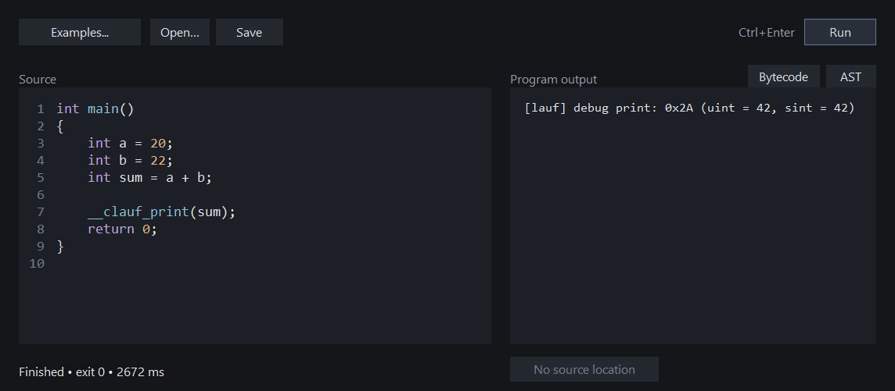

<h1 align="center">C playground</h1>

<p align="center">
  A for-fun C playground, built with C++ and <a href="https://github.com/foonathan/clauf">clauf</a>.
</p>

<p align="center">
  <a href="#features">Features</a> &nbsp;&middot;&nbsp;
  <a href="#building">Building</a> &nbsp;&middot;&nbsp;
  <a href="docs/LOCAL-SETUP.md">Documentation</a>
</p>



<p align="center"><sub>The <code>First run</code> example adds 20 and 22 and prints 42 using clauf's debug-print extension.</sub></p>

## Features

- **C editor** with syntax highlighting, line numbers, file saving and session restore.
- **Runtime diagnostics** with the original clauf output and a jump to the reported source line.
- **AST and bytecode views** that compile the snippet without running <code>main</code>.
- **Five examples** covering output, integer division, assertions and runtime errors.

Results belong to the source that produced them. If you edit a snippet after running it, the result is marked stale and source navigation is disabled until the source matches again.

## Building

The frontend runs on **Windows x64**. The engine currently runs in an **Ubuntu WSL** distribution. This is a hobby project with no completion target or planned executable downloads. Build it locally if you want to try it.

Requirements:

- Visual Studio 2026 with the C++ desktop workload, CMake and Python 3 on Windows.
- Git, Clang, CMake, Ninja, pkg-config and libffi development headers in Ubuntu WSL.

From the project directory:

```text
python build.py
cmake --preset windows
cmake --build --preset windows
```

The Python helper builds the pinned clauf engine in WSL. CMake builds the Windows app at `out/build/windows/Release/sacred-playground.exe`. The `windows` preset also works in Visual Studio. See [local setup](docs/LOCAL-SETUP.md) for details.

## Project status

This is something to tinker with and learn from. The edit/run/inspect loop works locally; anything beyond that is an experiment rather than a release plan.

Clauf supports a subset of C and has no preprocessor. The examples use <code>__clauf_print</code> and <code>__clauf_assert</code>, which are clauf extensions. Run trusted local snippets only: resource limits do not isolate the engine's host-function access.

## Acknowledgements

Built by [Yogesh / sacredcodr](https://github.com/sacredcodr). The compiler and runtime come from [clauf](https://github.com/foonathan/clauf) by Jonathan Müller and contributors, and its lauf backend.

This is an independent project. Clauf is distributed under the [Boost Software License 1.0](docs/licenses/clauf-LICENSE.txt); fetched dependencies retain their own notices.
